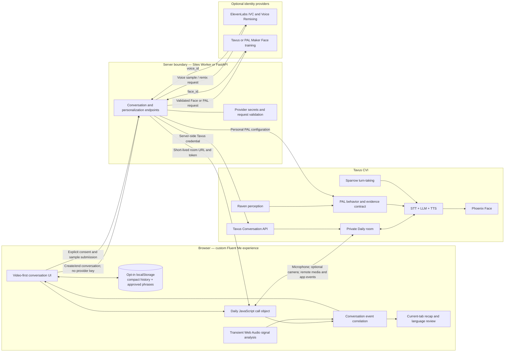
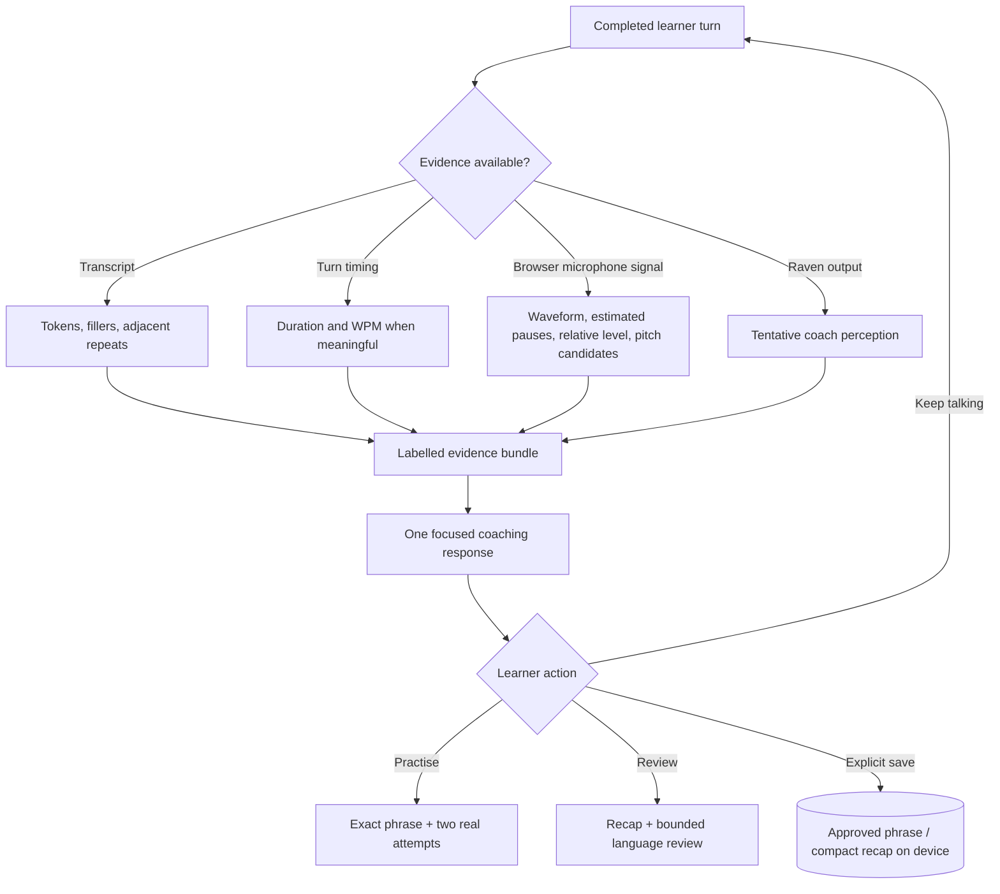

# Fluent Me — high-level architecture

## System diagram

## Runtime flow

1. The learner explicitly starts a session in the browser.
2. The server creates a Tavus conversation using a server-side credential and returns a private room URL plus a short-lived Daily meeting token.
3. The Daily client joins with microphone publication enabled. Camera publication remains off until the learner explicitly enables visual coaching.
4. Tavus runs the conversational pipeline. The Phoenix Face supplies the visual response, Sparrow manages turn timing, Raven may add audio/visual context, and the PAL controls coaching behavior and safety boundaries.
5. The browser receives conversation events and correlates speaking and final utterance evidence using available inference or turn identifiers before rendering a learner turn.
6. A browser AudioWorklet can inspect the local microphone signal transiently for a waveform, estimated pauses, relative level movement, and pitch candidates. Raw samples are discarded after the derived chart is produced.
7. Focused coaching uses Tavus interaction requests. Exact phrase modelling uses the interaction path intended to preserve wording; review and comparison requests include only bounded, labelled evidence.
8. Manual end, timed end, connection failure, and page exit attempt to end the remote Tavus conversation so credits and concurrency are not intentionally left active.

## Component responsibilities

| Component | Responsibility | Explicit boundary |
|---|---|---|
| Fluent Me UI | Conversation controls, feedback drawer, Practice, Review, captions, and visible state | Does not contain provider API keys |
| Daily client | Publishes microphone/optional camera and plays Tavus remote media | A working browser UI does not by itself prove media reached Tavus; final E2E verification is required |
| Event correlation | De-duplicates and associates speaking timing, utterance text, and optional analyses | Missing timing or perception remains unavailable |
| Browser signal analysis | Produces transient waveform, pause, level, and pitch-candidate summaries | Does not score pronunciation, accent, emotion, or English ability |
| Sites Worker / FastAPI | Creates and ends rooms, validates requests, proxies optional provider operations | Secrets stay on the server side |
| PAL | Conversation style, coaching actions, evidence-use rules, and safety language | Model output is coaching, not a certified assessment |
| Raven | Optional qualitative audio/visual context | `limited` perception is treated as tentative and never as an inner-emotion diagnosis |
| Sparrow | Turn-taking, responsiveness, and interruption behavior | Product logic still owns timers and explicit room cleanup |
| Local Learning Memory | Stores learner-approved phrase plus fixed scheduling metadata | Never stores full turns, raw media, waveform, pitch contour, or Raven observations |
| Compact Learning History | Stores up to 20 opted-in finalized recap records | Not a full conversation archive and not enabled retroactively |

## Evidence flow

## Privacy and trust boundaries

- Tavus and Daily process live conversation media and provider-side conversation data according to their services. Fluent Me does not create an additional server-side transcript or raw-media archive in this prototype.
- Current turn details, full transcript view, waveform, pitch contour, attempt evidence, recap, and Language Review live in the current browser tab unless the learner takes a separate, explicit local-save action.
- Learning Memory stores a learner-approved phrase and review metadata, not the turn that produced it.
- Learning History is opt-in before the session and retains only a compact finalized recap plus small aggregate metrics, with a maximum of 20 entries.
- Language Review sends at most the latest 12 non-empty learner turns to the live Tavus coach and displays its exact coverage.
- Provider credentials are server-side. No API key, signed preview handle, or raw biometric media belongs in browser storage or the submission artifacts.

## Optional personalization path

The optional identity path is separate from the core conversation flow:

1. The learner records and reviews Face and voice samples under explicit consent.
2. Nothing is submitted merely because a local recording exists.
3. ElevenLabs IVC receives an explicitly submitted voice sample through the server and returns a `voice_id` when the provider accepts it.
4. Voice Remixing can create target-accent comparison variants. Previewing and saving may consume credits or reusable voice slots.
5. Tavus/PAL Maker handles Face training and returns a `face_id` after asynchronous provider processing.
6. The server creates a personal PAL from the selected Face and voice references.

This path is integration-ready but its final status is provider-dependent. A submission should not claim a successful clone, remix, Face training run, or personal PAL unless that exact operation was verified against the submitted build and account.

## Operational failure boundaries

- A room consumes Tavus credits and concurrency while active; unrestricted public room creation needs access and spend controls.
- Browser tests and mocked provider contracts do not prove microphone publication, remote Face playback, Raven availability, or provider entitlement.
- A Face training recording is not the same as a completed Face. Training is asynchronous and may require a provider-owned workflow or valid hosted source media.
- Voice identity cloning can reproduce accent and recording artifacts. A remixed “Future Me” voice is a motivational model, not evidence that the learner pronounced every sound correctly.
